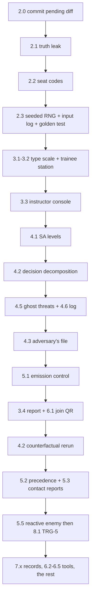

# FOGLINE — Upgrade spec (verified against the code, 2026-10-08)

**Audience:** the implementing agent. Read all of §0–§2 before touching code.
**Status of this file:** committed. Keep it capability-only (see §0.4).

Every claim about the current code below was checked by running it or reading it at the
line cited. Where the spec proposes something new, it says which existing function to
extend. If a line number has drifted, search for the function name. Do not trust older
specs: the previous draft of this file got the RNG, the auth state and the charts wrong.

---

## 0 · Ground rules

### 0.1 Hard constraints (from the team, non-negotiable)

- **Zero dependencies, no build step.** `package.json` has no `dependencies` and stays that
  way. Plain CommonJS on the server, plain browser scripts (IIFE + `window.X`, like
  `public/map.js:735 window.TacMap`) on the client. No TypeScript, bundler, or framework.
- **Node 18.** The dev machine runs v18.19.1. Use nothing newer.
- **Offline.** 3 laptops + 1 projector on local WiFi, no internet, 5 minutes with the
  judges. Nothing may fetch from the network at runtime. Fonts are already self-hosted in
  `public/fonts/`.
- **`npm test` stays green after every feature.** Today: 35 engine + 42 judgement + 21
  frontend = 98 passing. Run `npm run test:fuzz` too before declaring a tier done.

### 0.2 Invariants

1. **Three objects, never mixed.** Ground truth (`game.enemies`, instructor only) ≠ belief
   (`game.beliefs[pid]`, per commander) ≠ awareness ledger (`engine/comms.js:27
   AwarenessLedger`, when each commander could have known). `Game.traineeView(pid)`
   (`engine/sim.js:1330`) is the only thing a trainee may receive about the world.
2. **Every input is logged.** Trainee input enters through `Game.action` (`sim.js:920`),
   instructor input through `Game.admin` (`sim.js:1133`). New input types go through these
   two functions and nowhere else, so that §2.3 (input log) captures them.
3. **The red cell explains itself.** Every red-cell action carries a plain-language
   `reason` (`engine/redcell.js`). New adversary behaviour must do the same.
4. **Like against like.** Comparisons across rounds or trainees only compare runs of the
   same scenario and settings (`report.js` already enforces this for the progress chart;
   `/api/compare` returns `comparable`). Keep that discipline everywhere.
5. **Design language.** Paper map sheet (`--paper #e8e1d0`), board (`--board #2b2a24`),
   ink (`--ink #211e18`); blue friendly, red hostile, ochre caution, violet adversary.
   Archivo Narrow headings, Archivo body, IBM Plex Mono for grids/times/numbers.
   **No `border-radius`.** No dark "hacker terminal" look anywhere except the rail.

### 0.3 Definition of done for any feature

- [ ] `npm test` and `npm run test:fuzz` pass; new behaviour has at least one test
      (engine logic → `test/engine.test.js` or `test/judgement.test.js`; anything a page
      reads → `test/frontend.test.js` contract test).
- [ ] New input types go through `action`/`admin` and appear in the input log (§2.3).
- [ ] Truth never reaches a trainee: the leak test in §2.1 still passes.
- [ ] The feature shows up in the AAR (`engine/aar.js buildReport`) or is explicitly N/A.
- [ ] The red cell, if involved, writes a `reason`.
- [ ] The page still reads from 4 m on a projector (§3.1 type scale).
- [ ] README updated in neutral language (§0.4).

### 0.4 Stay low — operational security for the repo

The user's standing instruction: *"we should stay low from all the other participants."*

- `ROADMAP.md` is a local reference file and is listed in `.git/info/exclude`. Never
  commit it.
- No external names, event IDs or problem-statement numbers in any committed file,
  commit message, code comment, or test name. Keep it that way.
- Before each commit: `rg -ni "other teams|competit|rival" README.md public/ FOGLINE_UPGRADE.md`
  must return nothing.
- README and this spec describe what FOGLINE does, never how it compares.

---

## 1 · What already exists — do not rebuild

Verified by running a headless TRG-3 exercise with the red cell on AUTO and dumping the
report, plus reading the files. If a feature below looks missing in the UI, the data
already exists — wire it, don't recompute it.

| Capability | Where | Notes |
|---|---|---|
| Instructor token on `/events?role=instructor` and `/api/admin` | `server.js` (uncommitted diff), `public/instructor.js` reads `?token=` | Random 16-byte hex per boot or `INSTRUCTOR_TOKEN` env. Printed on start. **Commit this diff first** (§2.0). |
| Atomic writes for profiles and saved runs | `engine/profile.js save()`, `server.js saveAar()` | Uncommitted, same diff. |
| 4 scenarios | `engine/scenarios.js` | `BASELINE` (TRG-1), `CONTESTED` (TRG-2), `DECEPTION` (TRG-3), `DRILL` (TRG-4). Same `RED_PACKAGE` (E1–E6) in all, so runs compare fairly. |
| EW as geography | `engine/ew.js EwField` | Jammers + GPS spoofer as map emitters, smooth falloff, terrain masking ×0.35, `dfCut()` gives trainees a coarse bearing. |
| Contradiction engine | `engine/sources.js VARIANTS` | 7 variants (DRONE_SPOOFED, DRONE_MISSED, SCOUT_STALE, SCOUT_FALSE, SIGINT_FOOLED, SIGINT_DUMMY, TWO_LIE). Each source lies in both directions. |
| Learned bias + targeting | `engine/calibration.js` (`addTrust`, `weakSpot`, `weakSpotReason`), `sim.js chooseVariant` (710) | Red cell rule `TARGETED_CONTRADICTION` aims the next disagreement at the trainee's habit. |
| Persistent per-person record | `engine/profile.js ProfileStore` → `aar/profiles.json` | Keyed by the name a trainee types (`action type:'identify'`), not the callsign. `progress(names)` returns per-round calibration. |
| Red cell, 8 rules, OFF/ASSIST/AUTO, budget, cooldowns | `engine/redcell.js rules()` (58) | PRECONTACT_JAM, FLANK_FAKE, ISOLATE_RESERVE, FALSE_BDA, FORGED_ORDER, SPOOF_POSITION, TARGETED_CONTRADICTION, WINDOW (brief comms restore). |
| Forged-order authentication | `sim.js` `action type:'auth'` (1048) | Challenge travels over the degraded net; reply may never arrive. |
| Team chat over the degraded net | `sim.js` `action type:'chat'` (1062) | |
| Confidence on every judgement | `sim.js` `mark`/`resolve` (993–1047) → `this.judgements` | Feeds Brier scoring. |
| AAR | `engine/aar.js buildReport` | `costOfFog` (reaction delay, blind HP %, phantom actions, deception outcomes), `missionCommand` (coverage, breaches, initiative under isolation, forged-order compliance), `team` (COP divergence series, fratricide, mutual support, conflicts), per-player `threats` (ideal vs actual awareness), `fakes`, `falseBda`, `comms`, `ew`, `judgement` (calibration, trust, weakSpot, disputes), `progress`, `keyMoment` with frame, `redcell.log`. |
| Report charts (SVG, hand-rolled) | `public/report.js` | `dumbbell` (58, cost of fog), `timeline` (102), `copChart` (182), `compare` (275), `believeCard` (315), `progressChart` (359, **Brier by round with n and "too few" marking**), `drawKeyMoment` (424). |
| Replay with scrub | `public/replay.js`, `engine/recorder.js` (1 Hz frames + bookmarks) | |
| Saved runs, comparison, exports | `server.js` `/api/runs`, `/api/run/:id`, `/api/compare`, `/api/aar.json`, `/api/aar.csv` | |
| Pause, end, reset, time scale, live config | `sim.js admin` cases `pause`, `end`, `reset`, `config` (`cfg.timeScale`) | |
| Instructor injects | `admin` cases `link`, `fake`, `spoof`, `emitter`, `message`, `contradiction`, `bookmark` | |
| Screenshot tool | `tools/shoot.js`, `npm run shots` | CDP-based, because SSE pages never fire "load". |
| Radio audio | `public/radio.js` | Already exists; check what it does before adding any audio. |

**Consequence for the old spec:** "PIN gate", "calibration chart SVG", "time compression",
"per-round improvement chart", and "source reliability tracking" are already built.
Don't redo them. Where this spec improves them, it says so explicitly.

---

## 2 · Tier 0 — Defects that undercut the product's own claims (do these first)

These are not features. Each one breaks a sentence FOGLINE says about itself.

### 2.0 Commit the pending diff — **S**

`git diff` shows the instructor-token work and atomic writes in `server.js`,
`public/instructor.js`, `engine/profile.js`. Tests pass with it. Commit it as one change
("instructor token, atomic saves") before starting anything else, so later diffs stay
reviewable. Do not commit `ROADMAP.md`.

### 2.1 Ground truth leaks through the read API — **S** — CRITICAL

**Verified:** only `/events?role=instructor` and `/api/admin` check the token. These do not:

| Route | What it leaks |
|---|---|
| `/api/replay` | Full replay frames: every enemy position, every fake flagged as fake. `getAar()` (`server.js:59`) builds a provisional report whenever `status !== 'LOBBY'`, i.e. **mid-exercise**. |
| `/api/aar`, `/api/aar.json`, `/api/aar.csv` | Threat list with true enemy types and axes, which tracks were fakes, red-cell log with reasons. Mid-exercise too. |
| `/api/run/:id`, `/api/runs`, `/api/compare` | Past runs (lower risk, but they reveal scenario truth for repeat drills). |
| `/api/profiles` | Every trainee's weak spot — i.e. what the red cell will target next. |

A trainee typing `/api/replay` into their browser mid-exercise sees the truth. That breaks
invariant 0.2.1, the thing the product is built on.

**Fix (smallest correct version):**
- One helper in `server.js`: `isInstructor(req, url)` — true if `?token=` or header
  `x-fogline-token` equals `INSTRUCTOR_TOKEN`. Compare with `crypto.timingSafeEqual` on
  equal-length buffers (stdlib, already imported).
- Rule: **while `game.status` is `RUNNING` or `PAUSED`, every truth-bearing route requires
  the token.** After `ENDED`, the debrief is open to the room (trainees should be able to
  open `/report` and `/replay` on their own laptops for the debrief — that's the point).
  `/api/profiles` always requires the token (it is the red cell's targeting data).
- Pages that call these (`public/report.js`, `public/replay.js`) pass the token through
  if the page URL has one, the same way `instructor.js` does with `ITOKEN`.
- Instructor console links to Report/Replay must carry `?token=`.

**Tests:** extract server construction into `createServer()` so a test can boot it on an
ephemeral port (keep `node server.js` behaviour identical). Then:
- Start an exercise; `GET /api/replay` without token → 401; with token → 200.
- After `end`: `GET /api/aar` without token → 200.
- `GET /api/profiles` without token → 401 in every state.
- **Leak test:** serialise `traineeView(pid)` for every pid at 50 ticks of a DECEPTION
  run and assert none contains an enemy `id` (`E1`…`E6`), a fake flag, any red-cell
  `reason`, or a true enemy position the commander has no track for. Keep this test
  forever; every later tier runs it.

### 2.2 Any browser can act as any commander — **S**

**Verified:** `POST /api/action` takes `pid` from the body (`sim.js:920` only checks it is
a known callsign). A trainee at ALPHA's laptop can send orders as BRAVO, and a judge's
phone on the WiFi can disrupt the demo.

**Fix:** seat codes, no accounts.
- On boot, generate one 4-digit code per callsign (`crypto.randomInt`), or read
  `SEAT_CODES=ALPHA:1234,BRAVO:…` for a fixed demo.
- Print trainee URLs with the code: `/trainee?pid=ALPHA&seat=4821`.
- `/events?pid=…` and `/api/action` require the matching `seat`. The instructor token is
  accepted for any seat (the instructor can drive a seat in a demo).
- `public/trainee.js` reads `seat` from the URL and sends it with every action.
- Tests: wrong seat → 401; right seat → 200; instructor token → 200.

### 2.3 The engine is not deterministic — **M** — CRITICAL (foundation for §4.2, §5.5, §6.5)

**Verified:** production uses `Math.random()` directly:
`engine/sim.js:35` (`rand`), `sim.js:456` (ISR), `sim.js:916` (outbound drop),
`engine/comms.js:8,17,19,22,87,88,105,111,113` (latency, drop, garble, position drift,
type confusion), `engine/ew.js:54` (DF jitter). The suites only *look* deterministic
because they overwrite the global `Math.random` with an LCG (`test/engine.test.js:17–40`,
`test/judgement.test.js:23`).

Consequences today:
- Two trainees running "the same" TRG-4 drill don't get the same exercise. Round-by-round
  calibration comparison is fair only on average.
- A saved run cannot be re-simulated. Counterfactuals are impossible.
- "Same seed + same inputs = same run" — a property any assessor will ask about — is false.

**Fix** (follow the pattern already in the repo: `sources.js:151 placeFor(..., rand = Math.random)`):
1. New `engine/rng.js` (~15 lines): `mulberry32(seed)` → `() => [0,1)`, and
   `seedFrom(string)` (FNV-1a). Pure.
2. `Game` constructor takes `opts.seed`; if absent, pick one at `reset()` and **store it**,
   so every run has a seed. `this.rng = mulberry32(this.seed)`. `reset()` re-seeds.
3. Replace every `Math.random()` in `engine/` with `this.rng()` / `sim.rng()`. `CommsNet`
   receives `rng` through its options object (`comms.js:45`). `garbleText(text, rng)`.
   `EwField.dfCut(pos, rng)`. `placeFor` callers pass `this.rng`.
4. `rg -n "Math.random" engine/` must return nothing. Add a test that reads the engine
   files and asserts this, so it never regresses.
5. Seed goes into the AAR (`aar.seed`), the saved-run index, and in small mono type on
   the report header and instructor rail: `SEED 7F3A21C0`.
6. Instructor console: "Same exercise as…" starts the next run with a chosen seed
   (default: the last run's). That's how two trainees get an identical drill.
7. **Input log.** `Game` keeps `this.inputs = []`. At the top of `action()` and `admin()`
   push `{ t: this.t, via, pid, a: structuredClone(a) }` (Node 18 has `structuredClone`).
   Red-cell executions already go through `admin(a, true)`, so they're captured. Store
   `inputs`, `seed`, `scenario.id`, `cfg` in the AAR.
8. **Golden test:** DECEPTION, seed 42, fixed input script (moves, marks, resolves, an
   auth, a chat), red cell AUTO, 300 ticks → `sha256` of the AAR minus timestamps equals
   a committed constant. Run twice in one process to catch hidden global state. Then
   `rerun(seed, scenario, cfg, inputs)` must reproduce the same hash.
9. Keep `test:fuzz` meaningful: under `FOGLINE_FUZZ=1`, pick a random seed and print it
   on failure.

**Watch out:** check `rg -n "Date.now|new Date" engine/`. `generatedAt` is metadata and
fine; anything that affects outcomes must use `this.t`.

---

## 3 · Tier 1 — The screens (the user rated the UI "20% of expectations")

The previous session never looked at the UI. **First step: run `npm run shots`
(`tools/shoot.js` has the Linux Chrome path fix) and look at every screenshot before
changing CSS.** Re-shoot after each screen. If no browser is available, say so in the
final report — don't claim visual work is done without having seen it.

### 3.1 Projector type scale (applies everywhere) — **S**

Define once in `public/style.css` `:root` and use only these:

| Token | Size | Use |
|---|---|---|
| `--t-hero` | 56px | report headline number |
| `--t-h1` | 28px | page title in rail |
| `--t-h2` | 17px | card titles (uppercase, `letter-spacing:.08em`, full ink, not faded) |
| `--t-body` | 15px | everything a person reads |
| `--t-small` | 13px | secondary text — **the floor; nothing smaller anywhere** |
| `--t-mono` | 14px | grids, times, numbers |

Known offenders from the earlier review (verify selectors in `style.css` first): card `h3`
at 12px in faded ink; `.track .acts` buttons at 11px; `.why` buttons with no visual
affordance; cramped `.rail .sub`; no separation between map and order form.

Contrast: every text/background pair ≥ 4.5:1 (body), ≥ 3:1 (≥ 17px). Check `--ink-3` on
`--paper`; darken it if it fails. Washed-out projectors kill low contrast first.

### 3.2 Trainee station `/trainee?pid=…&seat=…` — **L**

The commander stares at this for 20 minutes. Priorities in order:

1. **State is unmissable.** Rail shows link state as a boxed label coloured by state
   (CLEAR blue, DEGRADED ochre, JAMMED/ISOLATED red) plus the DF bearing when jammed
   (`traineeView.df` already carries `bearing`, `spread`, `name`). When the link drops,
   the rail border flashes red once for 1 s — no looping animation.
2. **The disagreement card is the hero.** When `traineeView.disputes` has an open item it
   moves to the top of the sidebar, full width: three source claims side by side
   (GROUND / DRONE / SIGINT), countdown bar, two large buttons ENEMY THERE / AREA CLEAR,
   and the confidence picker (`picker()` / `submitJudgement` exist at `trainee.js:139,147`).
   Buttons ≥ 44px tall.
3. **Contacts list.** One row per track: id (mono), type, grid, age ("4 min old"), source
   tag, mark state. Mark buttons ≥ 32px tall, ≥ 13px text. Selected row: 3px blue left
   border + faint blue wash. Stale tracks fade but stay ≥ 4.5:1.
4. **Map / order form separation.** 2px ink rule above the order form. MOVE / FIRE / UAV /
   HOLD as a segmented control; active one inverted.
5. **Inbox.** Garbled text keeps its `#` characters in a distinct weight so it reads as
   damage, not a bug. Each message shows sent → received time and lag in mono.
6. **Keyboard.** Keep existing shortcuts (`trainee.js:104`) and show them in a legend.

### 3.3 Instructor console `/instructor?token=…` — **L**

Projected at 6 m. Layout: truth map (~60%) · three belief mini-maps stacked · feed + red
cell + injects.

- Red-cell panel: each proposal (`redcell.view().recs`) as a card with rule name, target,
  the `reason` sentence at body size, expiry countdown, APPROVE / DISMISS. Violet left
  border. In AUTO mode, executed actions stream here.
- Strip under each belief map: picture accuracy %, link state, open disputes, seconds
  since last order; ochre/red on thresholds.
- Inject buttons ≥ 15px; destructive ones (JAM ALL, END) separated and red.
- **Truth ↔ belief slider** per mini-map (client-side only; `instructorView.beliefs` and
  `enemies` are already in state): 0 = belief, 1 = truth, between = both, truth drawn as
  dashed red outlines. For the debrief.

### 3.4 Report `/report` — **M**

Closest to acceptable. Changes:
- Headline: cost of fog as one number at `--t-hero` (reaction delay, minutes), with
  blind-HP % and deceptions believed beside it. The first thing a judge sees.
- Fixed colour per callsign across every chart. Check `report.js` `K.slot1…` first and
  keep what exists if it's already consistent.
- New sections from §4 slot in here (SA levels, error decomposition, ghost threats).
- `@media print` producing a clean A4 debrief (no rail, charts full width, page break
  before each commander). Replaces any need for PDF generation.

---

## 4 · Tier 2 — Deepen the moat: judgement, calibration, the learning opponent

FOGLINE's strongest ground: it measures *who you believed and how sure you were*, and the
adversary *learns the person*. Everything here deepens that. §4.2's rerun needs §2.3.

### 4.1 Situation-awareness levels, measured without freezing the exercise — **M**

Assessors know Endsley's three SA levels and the SAGAT freeze-probe method. FOGLINE can
measure all three **without stopping play**, because it holds truth and belief side by
side. That's a stronger claim than freeze probes; state it plainly.

| Level | Question | Measure | Source |
|---|---|---|---|
| SA-1 Perception | Is the enemy on your map where it really is? | Mean picture accuracy | `sim.js computeAccuracy` (598) → `players[pid].meanAccuracy` |
| SA-2 Comprehension | Do you understand what the reports mean? | Judgement accuracy + Brier | `judgement.calibration` |
| SA-3 Projection | Can you predict what happens next? | **New:** projection calls | below |

**Projection calls** (`action type:'project'`): scenarios define moments, e.g.
`probes: [{ at: 90, ask: 'axis', options: ['WEST','EAST','BOTH'] }, { at: 150, ask: 'eta', bridge: 'BR_EAST' }]`.
The trainee gets a small non-blocking card ("Where will the main effort cross? · how
sure?"), answered with the existing confidence picker or ignored (ignoring is recorded,
like `froze` for disputes). Auto-scored from truth: `axis` against the `role:'main'`
enemy's axis in `RED_PACKAGE`; `eta` within ±2 mission-min of first enemy entry into the
bridge area. Feeds the same Brier machinery (`calibration.calibrate`), reported as SA-3.

AAR: `aar.sa = { [pid]: { sa1, sa2, sa3, n } }`. Report: three horizontal bars per
commander (Perception / Comprehension / Projection) with "too few" shown the way
`progressChart` does it, and one line of method text.

Optional classic SAGAT freeze (`admin type:'freeze'`): pause and push the probe card to all
seats at once. The continuous version stays the default.

### 4.2 Was it the fog or the judgement? — **M** (decomposition) + **L** (rerun, needs §2.3)

**Decision decomposition** (no rerun needed). For each entry in `game.judgements`:
- *Fooled* — wrong, and every delivered source was wrong, or it was a red-cell target.
- *Misread* — wrong, though a delivered source was right and the commander's own trust
  record favoured that source. A judgement error.
- *Right under fog* — correct although most delivered sources were wrong. What training
  is for.
- *Right* — correct with sources agreeing.

Computable from each dispute's `d.claims[].delivered/.correct/.stance` and the trust map
at that time. Report per commander: "4 of 9 wrong calls were the fog, 5 were judgement."

**Counterfactual rerun** (`engine/counterfactual.js`):
- `rerun(aar, overrides)` → fresh `Game` with `aar.seed`, scenario, config + overrides,
  feeds `aar.inputs` at their recorded `t`, ticks to the same end, returns `buildReport`
  without replay frames.
- Overrides: `clearComms` (`ewEnabled:false`, `dropRate:0`, `garbleRate:0`, base delay),
  `noRedcell`, `noDeception` (red cell may jam but not fake/forge/spoof).
- **Caveat to handle and state in the report:** inputs were made in response to what the
  trainee saw; with clear comms they'd have acted differently. Replaying the same inputs
  gives a *lower bound* on the fog's cost, not an alternate history. Inputs that become
  invalid in the rerun (marking a track that never appeared) are skipped and counted.
- Report section "What the fog cost this team": actual vs clear comms for HP lost,
  enemies stopped, objective held, reaction delay — computed, not estimated.

### 4.3 The opponent's file on you — **M**

The red cell already learns source trust. Extend what it learns, and **show the
instructor what the red cell believes about each person.** In a demo this is the most
persuasive screen: the machine keeps a file on you.

New traits (in `engine/calibration.js`, or `engine/habits.js` if that file passes ~200
lines), each from data already logged:

| Trait | Evidence | Exploit |
|---|---|---|
| Source trust (exists) | `addTrust` | `TARGETED_CONTRADICTION` (exists) |
| Never authenticates | forged orders received vs `auth` actions | Weight `FORGED_ORDER` toward them |
| Freezes under load | disputes `froze` while `underFire` or jammed | Time contradictions to coincide with contact |
| Trusts the latest report | marks flip to match the newest source | Send the lie *after* the truth |
| Acts on one source | fire/move on tracks with a single uncorroborated source | `FLANK_FAKE` with single-source fakes |
| Overconfident | mean confidence − accuracy > 0.15, n ≥ `MIN_N` | Favour `TWO_LIE` |

Each trait stores `{ score, n, lastSeen }` in the profile so it follows the person between
rounds, like trust does now. Instructor panel: an "Adversary's file" card per seat with
the top two traits in a sentence each, with evidence counts ("ignored 3 of 3 forged
orders — sending more"). The red cell's `reason` cites the trait.

**Guard:** trainees never see this during play. The debrief shows it after — "this is
how the opponent saw you" is the teaching moment.

### 4.4 Adaptive drill director — **M**

Deterministic director for TRG-4 holding each trainee in a target band: last 5
judgements ≥ 80% right → raise difficulty (shorter TTL, more `TWO_LIE`, aim at the top
trait); ≤ 40% → lower it (longer TTL, single-liar variants, `disputeFeedback` on). Uses
`this.rng`, logs every choice as a red-cell action with a `reason` ("ALPHA is getting
these right; tightening the clock"). Config `director: true|false`. Report shows
difficulty over time under the Brier line.

### 4.5 Ghost threats: dismissed, then hit by it — **S**

First check whether `aar.js` already records this (`rg -n "DISMISSED" engine/aar.js`). If
not: for each friendly HP loss, find the enemy that caused it; if the commander's belief
had a track on it marked `DISMISSED` before the loss, record
`{ track, dismissedClock, confidence, source, lossClock, hpLost }`. Report section
"Dismissed, then hit by it", sorted by HP lost. The most memorable line in a debrief.

### 4.6 Commander's log — **S**

`action type:'note'`, free text ≤ 220 chars (sanitise like `rationale`), stored with
mission time, no gameplay effect, does not travel over the net. Shown in ochre on the
report timeline and in replay at its timestamp. Lets the instructor ask "what were you
thinking at 06:14?" with the answer on screen.

### 4.7 Person dossier — **S**

`/dossier?name=…` (instructor token). One page per person from `ProfileStore`: rounds,
Brier by round (reuse `progressChart`), trust profile, traits from §4.3, SA history,
best and worst calls linking to the replay moment. Print stylesheet so it becomes a
training record; CSV export one row per round.

---

## 5 · Tier 3 — Simulation depth that creates real decisions

Every item must create a decision a commander makes, not just more simulation.

### 5.1 Emission control: transmitting gives you away — **M** — signature feature

FOGLINE already gives trainees a DF bearing on the enemy jammer (`ew.js dfCut`). Make it
symmetric: **the enemy direction-finds you when you transmit.**

- Every outbound transmission (orders to HQ, chat, auth challenges, contact reports)
  creates an emission at the unit's position in `game.emissions`.
- One enemy DF site per scenario (defined in `scenarios.js EMITTERS`). Two bearings on
  the same unit within N seconds give a fix; error grows with distance.
- A fix brings indirect fire after `cfg.dfFireDelay` (e.g. 45 mission-s) unless the unit
  has moved > 80 m. Uses `this.rng`. Reason: "BRAVO transmitted 4 times in 60 s from the
  same spot."
- Trainee rail: emissions in the last 2 minutes and a warning glyph when a fix is
  likely. New order **SILENT** (radio silence on/off): receive only; teammates see
  "BRAVO — silent".
- AAR: emissions per minute, fixes taken, damage from fixes, time silent, and
  transmissions into a jammer (wasted and still detectable).

This creates the core dilemma of degraded-comms command: *talk and be found, or go quiet
and be alone*. It also gives mission command (`missionCommand.initiativePct`) a voluntary
dimension, not just enforced isolation.

### 5.2 Message precedence and the restore window — **M**

Outbound traffic queues when degraded (`CommsNet`). Add precedence FLASH / IMMEDIATE /
PRIORITY / ROUTINE; the queue drains by precedence. Defaults by type (FIRE request
IMMEDIATE, contact report PRIORITY, chat ROUTINE), changeable on the order form.

Tie in the existing `WINDOW` red-cell rule: when a window opens, the rail shows
"LINK UP — ~20 s" and the queue drains in precedence order; the rest waits. AAR:
precedence discipline — FLASH use, and whether FLASH traffic was urgent (e.g. FIRE on a
real enemy within 300 m). Overusing FLASH is scored as a discipline failure, the same
idea as overconfidence.

### 5.3 Structured contact reports between commanders — **M**

Commanders currently share by chat. Add `action type:'report'` (to team or one callsign)
with fields: size · activity · location (grid) · unit type · time seen · equipment — the
standard army contact-report fields. Use the field names in the UI, not an acronym.

- Travels the degraded net. **Garbling corrupts individual fields** (grid digits, type —
  `comms.js` already has `TYPE_CONFUSION`), so the receiver sees a plausible but wrong
  report.
- A received report creates/updates a track in the receiver's belief with source `SCOUT`
  (`sources.js` already documents SCOUT as "a flank commander's eyes passed on") and the
  sender's callsign, so it joins the trust model.
- AAR: per report, truth at send time vs what was sent (sender error) vs what arrived
  (net error). Team section: information-flow graph — three nodes, edges weighted by
  reports, latency and corruption per hop, in plain SVG. Bottleneck: the commander whose
  silence most lowered teammates' picture accuracy.

### 5.4 Relay through a teammate — **M**

`sim.js` already mentions relay — read it first. Target: a jammed commander's traffic can
route via a teammate with a better link and line of sight (`T.masked` exists). Each hop
adds delay and garble chance. The decision: CHARLIE (reserve) moves to high ground to
relay, trading reserve position for the team's comms. AAR records relay paths and
traffic carried.

### 5.5 Enemy that reacts to what commanders do — **L** (needs §2.3)

Enemy groups follow fixed `path`s (`scenarios.js`). Add optional `triggers`:

```js
{ id: 'E5', ..., triggers: [
  { when: { kind: 'held', task: 'DENY_E', forSec: 60 }, then: { reroute: 'WEST', after: 20 } },
  { when: { kind: 'killed', enemy: 'E2' }, then: { halt: true } },
] }
```

Conditions read **ground truth** (positions, kills, task coverage — all in `sim.js`),
never belief. Evaluate once per tick in `moveEnemies` (314). A reroute takes the named
axis's waypoints from `RED_PACKAGE`. Deterministic given seed + inputs. Every firing is
logged with a reason ("BR EAST held 60 s; E5 switching to the western crossing"), visible
to the instructor and in the AAR. This makes CHARLIE's reserve decision matter.

### 5.6 Source grading on every report — **S**

Each report shown to a trainee carries a two-character grade: source reliability (A–F)
and credibility (1–6), the standard intelligence grading system. Reliability from the
commander's *own* trust record for that source (`calibration.js`); credibility from
corroboration and age. Small mono tag ("B3") on track rows and inbox entries. AAR:
accuracy by grade — if A-graded reports weren't right more often than D-graded ones, the
commander's trust model was miscalibrated. Ties back to §4.

### 5.7 Night and visibility — **S**

`cfg.visibility` 0.3–1.0 on a scenario schedule (e.g. dusk at T+20 min) scales
`sensorRange` for own eyes and SCOUT and raises drone miss probability. Trainee map tints
darker. Cheap, and it makes "own eyes" fallible in a fair way.

---

## 6 · Tier 4 — Instructor power tools

### 6.1 Join page with QR codes — **M**

`/join` (instructor token, since it shows seat codes): one large QR per seat URL with the
URL in mono beneath. Commanders scan instead of typing during the demo.

`public/qr.js`: byte mode, ECC level M, versions 1–6 (enough for ~80 chars), fixed mask
acceptable; Reed–Solomon over GF(256), polynomial 0x11D. ~250–350 lines. **Test it**
against a committed fixture matrix (string of 0/1 generated once elsewhere — no runtime
dependency). Draw to `<canvas>`. Reuse the encoder to print an ASCII QR in the terminal on
`npm start` (half-block characters `▀▄█`).

### 6.2 Pause-and-teach with drawing — **M**

`admin type:'teach'` = pause + teaching state. Overlay canvas on the instructor map; tools
line, arrow, circle, text; colours red/blue/ochre. "Show to all" pushes the drawing in
normalised map coordinates over SSE; trainee maps show it until resume. On resume the
drawing and a one-line label are saved as a bookmark (`recorder.bookmark`) and shown in
replay at that moment.

### 6.3 Scripted inject timeline — **M**

A planned list `{ at: missionSec, admin: {…} }` per scenario or from a JSON file. The
console shows upcoming injects on a strip with countdowns; each can be fired early,
skipped or edited. Every fired inject goes through `admin()`, so it's logged. This is the
master scenario events list exercise controllers already work from.

### 6.4 Move entities live — **S**

Drag an enemy or emitter on the truth map → `admin type:'move_entity'`, logged. Lets the
instructor respond to the room ("they've ignored the east — move E4").

### 6.5 Restart from a moment — **M** (needs §2.3)

In replay, "Restart from here": rebuild the game by rerunning seed + inputs up to t, then
make it the live game (server holds one `game`; swap the reference and send a `reload`
SSE event). The debrief becomes "try that again from 06:14, and this time authenticate
the order."

---

## 7 · Tier 5 — Records and interoperability

### 7.1 Tamper-evident decision log — **S**

Hash-chain entries in `decisions`, `events`, `judgements` and `inputs`:
`h = sha256(prev.h + canonicalJSON(entry without h))` (stdlib `crypto`). Store the head
hash in the AAR; print it at the end of the report ("Record sealed: 9f2c…").
`GET /api/verify?run=…` recomputes the chain and reports the first broken link.

### 7.2 xAPI export — **S**

`GET /api/aar.xapi` (token rules from §2.1): xAPI statements, one per commander per run
and one per judgement (`verb: answered`, `result.success`, extensions for confidence,
source, variant). Plain JSON; no LRS client. Lets records go into a learning management
system.

### 7.3 Printable operations order — **S**

`/brief?scenario=…` renders a five-paragraph order (Situation, Mission, Execution,
Service support, Command & signal) from `scenarios.js` (`intent`, `tasks`, `brief`) with
the map. A4 print stylesheet. Hand one to each commander at the start.

### 7.4 Offline package — **S**

`npm run pack`: a ~30-line Node script copying `engine/ public/ server.js package.json
README.md` into `dist/fogline-<version>/` with `start.sh` and `start.bat`. For carrying to
the venue on a USB stick.

---

## 8 · Tier 6 — Content

### 8.1 TRG-5 · RESERVE — **M** (best after §5.5)

Both crossings threatened from minute 2; one is a feint that is only obvious with clear
comms. CHARLIE gets a `commit` card (WEST / EAST / HOLD, confidence, reason required),
scored against truth and by Brier. Forces ALPHA/BRAVO to report (§5.3) so CHARLIE can
decide.

### 8.2 Severity variants — **S**

`severity: light | standard | severe` scales delay, drop, garble, jammer power and
red-cell budget by 0.5 / 1 / 1.5. Selectable on the console, saved with the run;
comparisons only across equal severity (invariant 0.2.4).

### 8.3 Scenario files — **M**

Load extra scenarios from `scenarios/*.json` at boot through a hand-written
`validateScenario()` (required fields, coordinates inside `T.W`×`T.H`, non-empty paths,
known emitter types). Bad files are skipped with a clear message, never crash the server.
Built-ins stay in code.

---

## 9 · Quality gates

| Gate | Where | Added in |
|---|---|---|
| No `Math.random` in `engine/` | test reads the files | §2.3 |
| Golden hash for seed 42 DECEPTION run | engine test | §2.3 |
| `rerun(seed, inputs)` reproduces the hash | engine test | §2.3 |
| Trainee view never contains truth (50 ticks × 3 seats) | engine test | §2.1 |
| Read API needs the token mid-exercise | server test | §2.1 |
| Seat code required for actions | server test | §2.2 |
| Every new AAR field present, finite, no NaN | frontend contract test | each feature |
| Hash chain verifies; one tampered entry is detected | engine test | §7.1 |
| QR encoder matches fixture | unit test | §6.1 |
| Screens re-shot and looked at | `npm run shots`, manual | §3 |

---

## 10 · Build order



If time runs short, stop after **L**. Everything up to there strengthens the 5-minute
demo; after that it deepens the product.

**Demo script after Tier 2** (keep it here, not in the README):
1. Scan QR codes; three commanders join (30 s).
2. TRG-4 drill, round 1 (2 min). Instructor screen shows the adversary's file filling in.
3. Round 2, same seed: the red cell aims at the habit it found; its reason is on screen.
4. Report: Brier by round, SA bars, "4 of 9 wrong calls were the fog, 5 were judgement",
   "dismissed, then hit by it".
5. Close on the sealed record hash.

---

## 11 · Do not build

- **An LLM anywhere in the loop.** Needs a network or a heavy local model, breaks
  determinism, and can't learn an individual from a handful of judgements. Rules with
  written reasons are the right design for a closed network.
- **3D / VR, map tiles, real-world terrain.** High cost; the judged skill is judgement
  under contradiction, not geography.
- **A framework or bundler rewrite.** `node server.js` on any laptop is a feature.
- **User accounts or a database.** Seat codes + instructor token + JSON files cover a
  training room.
- **Voice over WebRTC.** Fragile on venue WiFi and measures nothing the text net doesn't.
  Check `public/radio.js` before adding any audio.
- **Metrics without a decision behind them.** Every number in the report must answer
  "what should this commander do differently next time?"

---

## 12 · What the implementing agent reports back

For each item done: files changed, the test that proves it, and a screenshot path for
anything visual. For each item skipped: why. List every line of this spec that turned out
wrong when checked against the code.
